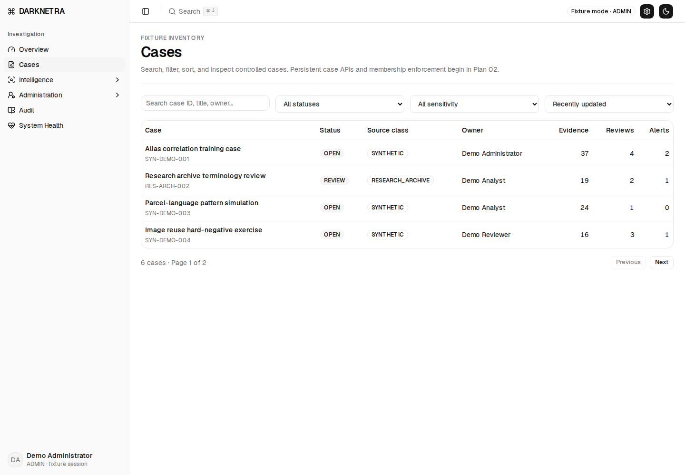
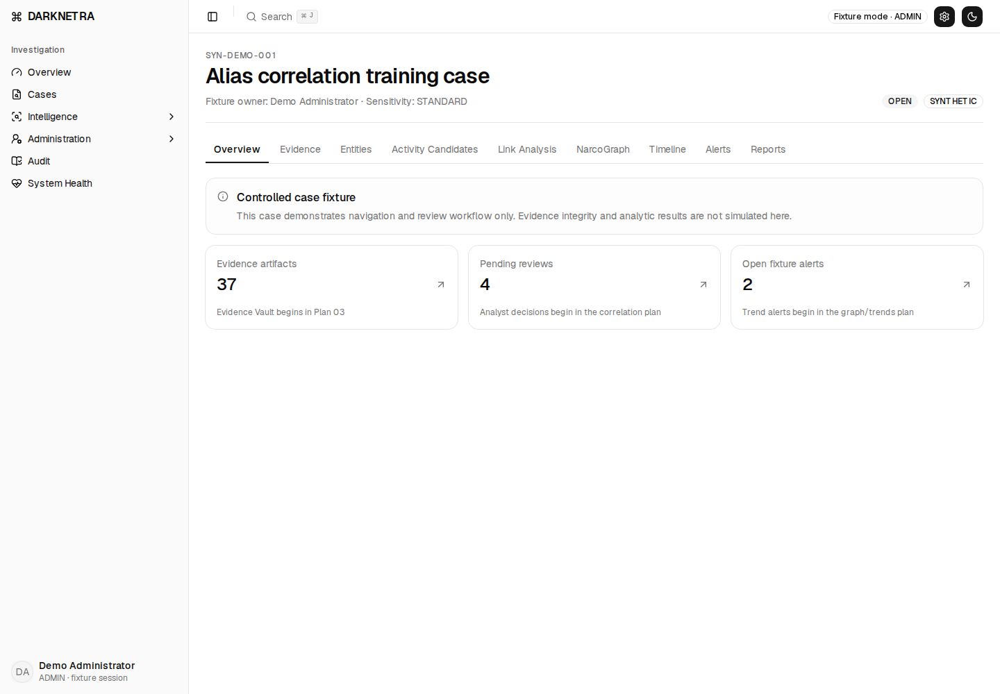
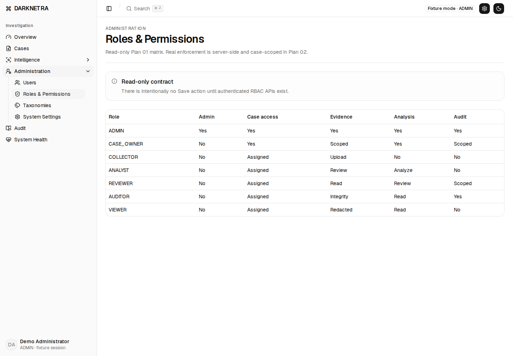
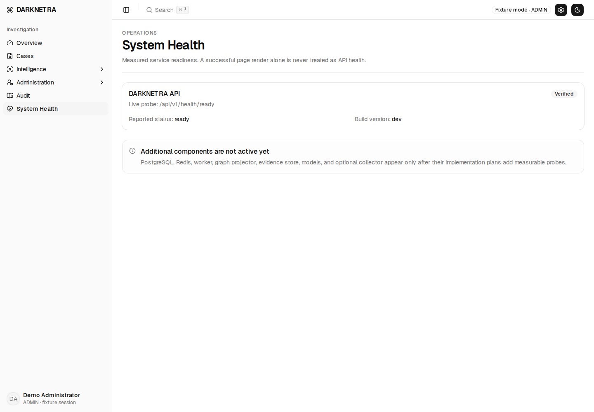
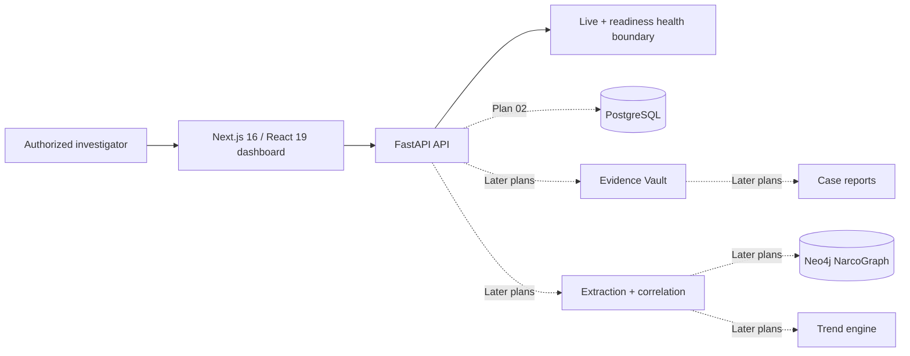

# DARKNETRA

> **Evidence-first, multilingual narcotics-intelligence and criminal-network discovery platform for authorized investigators.**

DARKNETRA is being developed for the **Chandigarh Police National Hackathon 2026 — Problem Statement 3**. The target product is designed to preserve source evidence, extract structured narcotics indicators, correlate cross-platform aliases, visualize investigation graphs, detect emerging trends, and generate evidence-linked investigation packs.

> [!IMPORTANT]
> **Current implementation status:** Plan 01 — Foundation & Investigator Dashboard — is complete on `testing-codex`. The screenshots below are generated from the real running application, but the case content is controlled synthetic/research-archive fixture data. Persistent authentication, PostgreSQL, Evidence Vault, extraction, link analysis, NarcoGraph, trends, and reports are implemented in later plans and are **not** represented as completed features here.

<p align="center">
  
</p>

---

## Table of contents

- [What DARKNETRA is](#what-darknetra-is)
- [Current capability status](#current-capability-status)
- [Screenshots](#screenshots)
- [Investigator workflow](#investigator-workflow)
- [Architecture](#architecture)
- [Technology stack](#technology-stack)
- [Repository structure](#repository-structure)
- [Prerequisites](#prerequisites)
- [Quick start with Docker](#quick-start-with-docker-recommended)
- [Native development installation](#native-development-installation)
- [Environment variables](#environment-variables)
- [Application URLs](#application-urls)
- [Common development commands](#common-development-commands)
- [Testing and verification](#testing-and-verification)
- [Docker operations](#docker-operations)
- [Troubleshooting](#troubleshooting)
- [Branch and development policy](#branch-and-development-policy)
- [Refreshing README screenshots](#refreshing-readme-screenshots)
- [Safety and legal boundary](#safety-and-legal-boundary)
- [Third-party attribution](#third-party-attribution)
- [Roadmap](#roadmap)

---

## What DARKNETRA is

DARKNETRA is intended to sit **above collection tools** and turn authorized source material into evidence-backed investigative intelligence.

The final product direction is:

```text
Authorized source material
        ↓
Evidence capture + integrity verification
        ↓
Drug / vendor / wallet / PGP / contact extraction
        ↓
Explainable cross-platform identity correlation
        ↓
Investigation graph + timeline
        ↓
Emerging-trend alerts
        ↓
Evidence-linked investigator report
```

The central design rule is simple:

> **The evidence is the source of truth. AI may help explain evidence, but it must never silently become the evidence.**

DARKNETRA is therefore designed around provenance, human review, explainability, auditability, and local/offline-friendly deployment rather than a generic chatbot experience.

---

## Current capability status

| Capability | Status | Notes |
|---|---|---|
| Investigator dashboard shell | ✅ Implemented | Responsive DARKNETRA-specific navigation and workspace shell |
| Overview dashboard | ✅ Implemented | Actionable fixture-backed metrics and queues |
| Cases workspace | ✅ Implemented | Searchable controlled fixture cases |
| Case workspace + nine tabs | ✅ Implemented | Overview, Evidence, Entities, Activity Candidates, Link Analysis, NarcoGraph, Timeline, Alerts, Reports |
| Roles & permissions UI | ✅ Implemented | Read-only role matrix in Plan 01 |
| FastAPI service | ✅ Implemented | Minimal live/readiness API boundary |
| System Health UI | ✅ Implemented | Measures API reachability; does not show a false green state |
| Dockerized web + API | ✅ Implemented | Non-root containers; loopback-only ports through the dev overlay |
| Unit / E2E / Docker verification | ✅ Implemented | Vitest, pytest, Playwright, Ruff, TypeScript, build and smoke gates |
| Persistent users/authentication | ⏳ Plan 02 | Not yet implemented |
| PostgreSQL + case membership + server RBAC | ⏳ Plan 02 | Not yet implemented |
| Persistent audit trail | ⏳ Plan 02 | Not yet implemented |
| Sensitive-field encryption | ⏳ Later plan | Not yet implemented |
| Evidence Vault | ⏳ Later plan | Not yet implemented |
| Multilingual narcotics extraction | ⏳ Later plan | Not yet implemented |
| Alias / identity correlation | ⏳ Later plan | Not yet implemented |
| Neo4j NarcoGraph | ⏳ Later plan | Not yet implemented |
| Emerging-trend engine | ⏳ Later plan | Not yet implemented |
| Evidence-linked case reports | ⏳ Later plan | Not yet implemented |
| Optional lawful Tor collector | ⏳ Optional final stage | Disabled and unnecessary for the current app |

---

## Screenshots

The following screenshots are captured automatically from the **running `testing-codex` application** at a 1440×1000 browser viewport.

### Investigator overview

<p align="center">
  
</p>

The overview is the investigator's landing workspace. Current metrics are controlled fixtures and are deliberately linked to operational destinations instead of being decorative dashboard cards.

### Cases

<p align="center">
  
</p>

The cases workspace provides the foundation for case-scoped investigation activity. Real persistent cases arrive with the Plan 02 database and authorization layer.

### Case workspace

<p align="center">
  
</p>

Each case has nine investigation sections:

1. Overview
2. Evidence
3. Entities
4. Activity Candidates
5. Link Analysis
6. NarcoGraph
7. Timeline
8. Alerts
9. Reports

Sections whose backends are not implemented yet explicitly display their live-data boundary instead of showing fabricated results.

### Roles & permissions

<p align="center">
  
</p>

The Plan 01 matrix communicates the intended authorization model. Persistent users, sessions, memberships, and API-enforced RBAC begin in Plan 02.

### System Health

<p align="center">
  
</p>

System Health performs a real API readiness probe. If FastAPI is unreachable, the interface reports an offline/unavailable state instead of inferring health from the fact that the Next.js page rendered.

> [!NOTE]
> The screenshots intentionally contain no live illicit-market data, real suspect information, or private investigative material.

---

## Investigator workflow

The approved product workflow is case-centered:

```text
Overview
  ↓
Cases
  ↓
Case Overview
  ├── Evidence
  ├── Entities
  ├── Activity Candidates
  ├── Link Analysis
  ├── NarcoGraph
  ├── Timeline
  ├── Alerts
  └── Reports
```

Global workspaces currently exposed by the DARKNETRA shell are:

```text
DARKNETRA
├── Overview
├── Cases
├── Intelligence
│   ├── Emerging Trends
│   └── Source Registry
├── Administration
│   ├── Users
│   ├── Roles & Permissions
│   ├── Taxonomies
│   └── System Settings
├── Audit
└── System Health
```

The UI deliberately uses terms such as **candidate**, **lead**, **analyst-confirmed**, and **rejected**. Automated signals must not be presented as proof of guilt.

---

## Architecture

### Current Plan 01 runtime



Only the solid Plan 01 path is active today. Dashed components are intentional future architecture and must not be treated as current functionality.

### Docker networking

The base `docker-compose.yml` keeps the application services on a private bridge network named `app`. The development overlay publishes only:

- `127.0.0.1:3000` → web
- `127.0.0.1:8000` → API

The containers do **not** use privileged mode, host networking, or a Docker socket mount.

---

## Technology stack

### Frontend

- Next.js 16
- React 19
- TypeScript 5
- Tailwind CSS 4
- shadcn-derived component system
- Biome for linting
- Vitest + Testing Library for unit/component tests
- Playwright for browser regression testing

### Backend

- Python 3.12
- FastAPI
- Pydantic / pydantic-settings
- Uvicorn
- pytest
- Ruff

### Tooling / runtime

- Node.js 24.x
- pnpm 10.15.0
- uv 0.12.4
- Docker + Docker Compose v2
- GitHub Actions
- Dependabot

### Planned backend systems

These are architectural targets, **not Plan 01 runtime dependencies**:

- PostgreSQL
- pgvector
- Redis
- worker queue
- Neo4j
- encrypted evidence/object storage
- local model services where justified
- optional isolated lawful collection adapter

---

## Repository structure

```text
darknetra/
├── apps/
│   ├── web/                     # Next.js investigator dashboard
│   └── api/                     # FastAPI service
├── packages/
│   └── contracts/               # Shared/API contracts
├── infrastructure/
│   └── docker/                  # Non-root web/API Dockerfiles
├── docs/
│   ├── architecture/            # Architecture/development documentation
│   ├── screenshots/             # Real generated README screenshots
│   ├── superpowers/             # Approved specs and implementation plans
│   └── verification/            # Milestone verification evidence
├── scripts/                     # Smoke/verification utilities
├── tests/
│   └── repo/                    # Repository-level architecture guardrails
├── LICENSES/                    # Required third-party notices
├── docker-compose.yml           # Internal application network
├── docker-compose.dev.yml       # Loopback development port exposure
├── package.json                 # pnpm monorepo root
├── pnpm-lock.yaml               # Locked JS dependency graph
├── pyproject.toml               # Python workspace/tooling
├── uv.lock                      # Locked Python dependency graph
├── Makefile                     # Developer shortcuts
└── README.md
```

---

# Installation

## Prerequisites

### Recommended for everyone

Install:

| Tool | Required version |
|---|---|
| Git | Current supported release |
| Docker | Current Docker Engine/Desktop |
| Docker Compose | Compose v2 |

If you use the Docker quick start, Docker handles the application runtimes for you.

### Required for native development

| Tool | Required version |
|---|---|
| Node.js | **24.x** |
| pnpm | **10.15.0** through Corepack |
| Python | **3.12.x** |
| uv | **0.12.4** |

The repository also includes `.node-version` and `.python-version` files to make runtime expectations explicit.

Verify your environment:

```bash
git --version
docker --version
docker compose version
node --version
python --version
uv --version
```

For native development, `node --version` must report Node 24 and Python must be 3.12.x.

---

## Clone the repository

This repository is private, so your GitHub account must have access.

### SSH — recommended

```bash
git clone git@github.com:jrdevadattan/darknetra.git
cd darknetra
git checkout testing-codex
```

### HTTPS

```bash
git clone https://github.com/jrdevadattan/darknetra.git
cd darknetra
git checkout testing-codex
```

For HTTPS, Git must already be authenticated with GitHub. A browser password is not used as a Git password.

Confirm the branch:

```bash
git branch --show-current
```

Expected during active development:

```text
testing-codex
```

---

## Quick start with Docker — recommended

This is the easiest and most reproducible way to run the current application.

### 1. Start the stack

From the repository root:

```bash
docker compose -f docker-compose.yml -f docker-compose.dev.yml up --build -d --wait
```

This will:

- build the FastAPI image;
- build the Next.js image;
- start the API on the internal Compose network;
- wait for the API health check;
- start the web application after the API is healthy;
- publish the web UI only on `127.0.0.1:3000`;
- publish the API only on `127.0.0.1:8000`.

### 2. Open DARKNETRA

Open:

```text
http://127.0.0.1:3000/dashboard
```

### 3. Verify the API

Live probe:

```bash
curl http://127.0.0.1:8000/api/v1/health/live
```

Readiness probe:

```bash
curl http://127.0.0.1:8000/api/v1/health/ready
```

You can also open:

```text
http://127.0.0.1:3000/system/health
```

### 4. Inspect containers

```bash
docker compose -f docker-compose.yml -f docker-compose.dev.yml ps
```

### 5. View logs

All services:

```bash
docker compose -f docker-compose.yml -f docker-compose.dev.yml logs -f
```

API only:

```bash
docker compose -f docker-compose.yml -f docker-compose.dev.yml logs -f api
```

Web only:

```bash
docker compose -f docker-compose.yml -f docker-compose.dev.yml logs -f web
```

### 6. Stop the stack

```bash
docker compose -f docker-compose.yml -f docker-compose.dev.yml down --remove-orphans
```

For a completely clean development teardown:

```bash
docker compose -f docker-compose.yml -f docker-compose.dev.yml down -v --remove-orphans
```

### 7. Run the deterministic Docker smoke test

```bash
bash scripts/smoke.sh
```

The smoke test builds/starts the stack, verifies API health, confirms the dashboard responds, and cleans up afterward.

---

## Native development installation

Use this path when actively developing the frontend or API without rebuilding Docker images after every change.

### 1. Select Node.js 24

If you use `nvm`:

```bash
nvm install 24
nvm use 24
node --version
```

Expected major version:

```text
v24.x.x
```

### 2. Enable pnpm 10.15.0

```bash
corepack enable
corepack prepare pnpm@10.15.0 --activate
pnpm --version
```

Expected:

```text
10.15.0
```

### 3. Select Python 3.12

```bash
python --version
```

Expected:

```text
Python 3.12.x
```

If your system uses a separate executable:

```bash
python3.12 --version
```

### 4. Install uv 0.12.4

If `uv` is not already installed, one Python-based option is:

```bash
python3.12 -m pip install "uv==0.12.4"
```

Then verify:

```bash
uv --version
```

Expected:

```text
uv 0.12.4
```

### 5. Install the locked JavaScript dependencies

```bash
pnpm install --frozen-lockfile
```

Do not casually replace this with an unlocked install when verifying a milestone.

### 6. Install the locked Python workspace

```bash
uv sync --all-packages --dev --frozen
```

### 7. Start the API — Terminal 1

Linux/macOS/WSL:

```bash
export DARKNETRA_ENVIRONMENT=development
export DARKNETRA_BUILD_VERSION=local-dev
uv run uvicorn --app-dir apps/api darknetra_api.main:app --reload --host 127.0.0.1 --port 8000
```

PowerShell:

```powershell
$env:DARKNETRA_ENVIRONMENT="development"
$env:DARKNETRA_BUILD_VERSION="local-dev"
uv run uvicorn --app-dir apps/api darknetra_api.main:app --reload --host 127.0.0.1 --port 8000
```

Verify:

```text
http://127.0.0.1:8000/api/v1/health/live
```

### 8. Start the web dashboard — Terminal 2

Linux/macOS/WSL:

```bash
export DARKNETRA_API_BASE_URL=http://127.0.0.1:8000
export NEXT_PUBLIC_DARKNETRA_API_BASE_URL=http://127.0.0.1:8000
pnpm --filter @darknetra/web dev
```

PowerShell:

```powershell
$env:DARKNETRA_API_BASE_URL="http://127.0.0.1:8000"
$env:NEXT_PUBLIC_DARKNETRA_API_BASE_URL="http://127.0.0.1:8000"
pnpm --filter @darknetra/web dev
```

Then open:

```text
http://127.0.0.1:3000/dashboard
```

### 9. Confirm System Health

Open:

```text
http://127.0.0.1:3000/system/health
```

With the API running, the page should show the API as verified/ready. Stop the API and refresh the page to confirm DARKNETRA truthfully reports the unavailable state.

---

## Environment variables

`.env.example` documents the development values. The currently relevant variables are:

| Variable | Purpose | Native example | Docker value |
|---|---|---|---|
| `DARKNETRA_ENVIRONMENT` | API environment name | `development` | `development` |
| `DARKNETRA_BUILD_VERSION` | Build/version label returned by health | `local-dev` | `docker-dev` |
| `DARKNETRA_API_BASE_URL` | Server-side Next.js → FastAPI URL | `http://127.0.0.1:8000` | `http://api:8000` |
| `NEXT_PUBLIC_DARKNETRA_API_BASE_URL` | Browser-visible API base URL | `http://127.0.0.1:8000` | `http://localhost:8000` |

> [!WARNING]
> Anything prefixed with `NEXT_PUBLIC_` is exposed to browser JavaScript. Never place secrets, tokens, case credentials, private keys, or sensitive investigator configuration in a `NEXT_PUBLIC_*` variable.

Future plans will add database, session, encryption, evidence-store, worker, and graph configuration. Those variables are intentionally not documented as current requirements yet.

---

## Application URLs

When running the development stack:

| Service / page | URL |
|---|---|
| Investigator overview | `http://127.0.0.1:3000/dashboard` |
| Cases | `http://127.0.0.1:3000/cases` |
| Demo case | `http://127.0.0.1:3000/cases/SYN-DEMO-001` |
| Emerging trends shell | `http://127.0.0.1:3000/intelligence/trends` |
| Source registry shell | `http://127.0.0.1:3000/intelligence/sources` |
| Users shell | `http://127.0.0.1:3000/admin/users` |
| Roles & permissions | `http://127.0.0.1:3000/admin/roles` |
| Taxonomies shell | `http://127.0.0.1:3000/admin/taxonomies` |
| System settings shell | `http://127.0.0.1:3000/admin/settings` |
| Audit shell | `http://127.0.0.1:3000/audit` |
| System Health | `http://127.0.0.1:3000/system/health` |
| API live health | `http://127.0.0.1:8000/api/v1/health/live` |
| API readiness | `http://127.0.0.1:8000/api/v1/health/ready` |

---

## Common development commands

### Frontend

```bash
pnpm --filter @darknetra/web dev
pnpm --filter @darknetra/web lint
pnpm --filter @darknetra/web typecheck
pnpm --filter @darknetra/web test
pnpm --filter @darknetra/web build
```

Root JavaScript checks:

```bash
pnpm lint
pnpm typecheck
pnpm test
pnpm build
pnpm check
```

### Backend

```bash
uv run ruff check .
uv run pytest -q
uv run uvicorn --app-dir apps/api darknetra_api.main:app --reload
```

### Make shortcuts

The repository currently provides:

```bash
make bootstrap
make dev
make test
make check
make build
make smoke
```

For reproducible milestone verification, prefer the explicit locked commands documented in [Testing and verification](#testing-and-verification).

---

## Testing and verification

### Python checks

```bash
uv run ruff check .
uv run pytest -q
```

### Frontend checks

```bash
pnpm --filter @darknetra/web lint
pnpm --filter @darknetra/web typecheck
pnpm --filter @darknetra/web test
pnpm --filter @darknetra/web build
```

### Install Playwright Chromium

First-time browser-test setup:

```bash
pnpm --filter @darknetra/web exec playwright install chromium
```

On Linux CI or machines missing browser system dependencies:

```bash
pnpm --filter @darknetra/web exec playwright install --with-deps chromium
```

### Browser regression tests

```bash
pnpm --filter @darknetra/web test:e2e
```

The Plan 01 E2E gate checks both:

- **reachable API mode** — dashboard/cases/navigation plus a real readiness state;
- **unavailable API mode** — System Health must show an unavailable state and must not show a false `Verified` state.

### Compose validation

```bash
docker compose -f docker-compose.yml -f docker-compose.dev.yml config >/dev/null
```

### Docker smoke test

```bash
bash scripts/smoke.sh
```

### Full Plan 01 verification sequence

```bash
uv run ruff check .
uv run pytest -q
pnpm --filter @darknetra/web lint
pnpm --filter @darknetra/web typecheck
pnpm --filter @darknetra/web test
pnpm --filter @darknetra/web build
pnpm --filter @darknetra/web test:e2e
docker compose -f docker-compose.yml -f docker-compose.dev.yml config >/dev/null
bash scripts/smoke.sh
```

Verification evidence for the milestone is stored in:

```text
docs/verification/plan-01-foundation-dashboard.md
```

---

## Docker operations

### Rebuild after dependency or Dockerfile changes

```bash
docker compose -f docker-compose.yml -f docker-compose.dev.yml up --build -d --wait
```

### Force a clean image rebuild

```bash
docker compose -f docker-compose.yml -f docker-compose.dev.yml build --no-cache
```

### Restart a single service

```bash
docker compose -f docker-compose.yml -f docker-compose.dev.yml restart api
```

or:

```bash
docker compose -f docker-compose.yml -f docker-compose.dev.yml restart web
```

### Inspect the effective Compose configuration

```bash
docker compose -f docker-compose.yml -f docker-compose.dev.yml config
```

### Clean development stack

```bash
docker compose -f docker-compose.yml -f docker-compose.dev.yml down -v --remove-orphans
```

---

## Troubleshooting

### `git clone` returns 403 / repository not found

The repository is private. Confirm:

- your GitHub account has repository access;
- your SSH key is added to GitHub if cloning over SSH; or
- your HTTPS Git credentials/token are configured correctly.

### Wrong Node.js version

Check:

```bash
node --version
```

DARKNETRA currently expects Node 24.x. With `nvm`:

```bash
nvm install 24
nvm use 24
```

### `corepack` / `pnpm` problems

Re-enable and pin pnpm:

```bash
corepack enable
corepack prepare pnpm@10.15.0 --activate
pnpm --version
```

Then reinstall using the lockfile:

```bash
pnpm install --frozen-lockfile
```

### Python version is not 3.12

The API workspace requires `>=3.12,<3.13`.

Check:

```bash
python --version
```

You can direct uv to Python 3.12 when it is available:

```bash
UV_PYTHON=3.12 uv sync --all-packages --dev --frozen
```

PowerShell:

```powershell
$env:UV_PYTHON="3.12"
uv sync --all-packages --dev --frozen
```

### `uv sync` fails after dependency changes

First ensure you are on the intended branch and that `uv.lock` is present. For the verified state, do not silently regenerate dependency versions; use:

```bash
uv sync --all-packages --dev --frozen
```

If a dependency change is intentional, update the lockfile as a reviewed change rather than working around the frozen error.

### Port 3000 or 8000 is already in use

Linux/macOS:

```bash
lsof -i :3000
lsof -i :8000
```

Windows:

```powershell
netstat -ano | findstr :3000
netstat -ano | findstr :8000
```

Stop the conflicting process or change the development port intentionally.

### Dashboard loads but System Health says API unreachable

Check the API directly:

```bash
curl http://127.0.0.1:8000/api/v1/health/live
```

For native development, confirm both variables are present in the web terminal:

```text
DARKNETRA_API_BASE_URL=http://127.0.0.1:8000
NEXT_PUBLIC_DARKNETRA_API_BASE_URL=http://127.0.0.1:8000
```

For Docker, make sure you started **both** Compose files:

```bash
docker compose -f docker-compose.yml -f docker-compose.dev.yml up --build -d --wait
```

The base Compose file intentionally does not publish the services to your host by itself.

### Docker stack does not become healthy

Inspect:

```bash
docker compose -f docker-compose.yml -f docker-compose.dev.yml ps
docker compose -f docker-compose.yml -f docker-compose.dev.yml logs api
docker compose -f docker-compose.yml -f docker-compose.dev.yml logs web
```

Then retry from a clean state:

```bash
docker compose -f docker-compose.yml -f docker-compose.dev.yml down -v --remove-orphans
docker compose -f docker-compose.yml -f docker-compose.dev.yml up --build -d --wait
```

### Playwright says Chromium is missing

```bash
pnpm --filter @darknetra/web exec playwright install chromium
```

Linux with missing system libraries:

```bash
pnpm --filter @darknetra/web exec playwright install --with-deps chromium
```

### A future page says `Interface ready`

That is intentional in Plan 01. Evidence, Entities, Link Analysis, NarcoGraph, Timeline, Alerts, Reports, and other later-plan surfaces explicitly tell the investigator which backend milestone owns the live-data boundary. This avoids fake functionality during development.

---

## Branch and development policy

- **`main`** — stable branch. No direct feature development.
- **`testing-codex`** — current integration and agentic-development branch.

The current Plan 01 milestone is verified on `testing-codex`. Future work should continue milestone-by-milestone with tests and verification evidence before it is considered complete.

When implementing a feature:

1. Read the approved design and the relevant plan in `docs/superpowers/`.
2. Add or update the relevant contract/test first where practical.
3. Implement the smallest compliant change.
4. Run focused tests.
5. Run the full milestone gate before claiming completion.
6. Keep fixture/synthetic data clearly labeled.
7. Never silently convert a planned interface into a fake production result.

---

## Refreshing README screenshots

README images are generated from the real application by:

```text
.github/workflows/readme-screenshots.yml
```

The workflow:

1. installs the locked Python and Node workspaces;
2. builds the dashboard;
3. starts FastAPI and Next.js;
4. waits for both services to respond;
5. uses Playwright Chromium at 1440×1000;
6. captures Overview, Cases, Case Workspace, Roles, and System Health;
7. verifies that the PNG files are non-trivial;
8. commits updated images to `docs/screenshots/`.

To refresh images manually in GitHub:

```text
Actions → README screenshots → Run workflow
```

This is preferable to hand-editing screenshots because the README then reflects an actual runnable branch state.

---

## Safety and legal boundary

DARKNETRA is an intelligence-triage and evidence-correlation platform for lawful, authorized use.

The project must **not**:

- purchase illegal drugs;
- contact or negotiate with sellers;
- facilitate a transaction;
- bypass encryption;
- defeat authentication or access controls;
- join private criminal services without lawful authorization;
- deploy malware;
- treat an automated identity link as proof that two people are the same person;
- treat a candidate score as proof of criminality;
- expose sensitive case data to unnecessary external services.

A lawful deployment may work with public material, research archives, investigator-authorized sources, and lawfully obtained exports. The hackathon/demo environment should prefer controlled synthetic or approved research data so the technical demonstration is reproducible and safe.

---

## Data and confidence language

DARKNETRA uses intentionally cautious investigation terminology:

```text
Candidate
Lead
Pending review
Analyst-confirmed
Rejected
Verified
Warning
Failed
Offline
```

These labels describe system/workflow states. They do not constitute legal findings or proof of guilt.

---

## Third-party attribution

The investigator interface adapts selected patterns/components from the MIT-licensed:

```text
arhamkhnz/next-shadcn-admin-dashboard
```

The imported dashboard baseline was pinned during the design phase and unrelated ecommerce, CRM, finance, academy, mail, chat, calendar, promotional, social-auth, and demo-only surfaces were removed instead of simply being hidden.

Required attribution is retained under:

```text
LICENSES/next-shadcn-admin-dashboard-MIT.txt
```

A project-level license for DARKNETRA itself has not been declared by this README; third-party license notices must be preserved regardless of the eventual project licensing choice.

---

## Roadmap

The implementation plans live under `docs/superpowers/plans/`. The current sequence is intentionally staged:

```text
Plan 01  Foundation + Investigator Dashboard                 ✅ Complete
Plan 02  API + PostgreSQL + Auth + Users + Case RBAC         ⏳ Next
         Authentication normative supplement                 ⏳ Next
         Sensitive-field encryption                          ⏳
Plan 03  Evidence Vault + secure ingestion                    ⏳
Plan 04  Multilingual narcotics/entity extraction             ⏳
Plan 05  Activity detection + identity correlation            ⏳
Plan 06  Graph + trends + reports                             ⏳
Plan 07  Evaluation + offline finale hardening                ⏳
Optional Lawful isolated collector                            ⏳ Last / optional
```

The optional collector is not a prerequisite for the core product. DARKNETRA's main differentiator is the **evidence → extraction → explainable correlation → graph/trend → investigator report** workflow, not crawling by itself.

---

## Plan 01 verification

The exact Plan 01 code milestone has a committed verification record in:

```text
docs/verification/plan-01-foundation-dashboard.md
```

That record documents successful execution of:

```text
Ruff
pytest
Biome lint
TypeScript typecheck
Vitest
Next.js production build
Playwright reachable-API regressions
Playwright unavailable-API regression
Docker Compose validation
Docker smoke test
showcase-removal regression scan
```

The README screenshots were generated after that milestone and are intentionally documentation-only artifacts.

---

## Project principle

> **Find less noise. Preserve more evidence. Explain every link. Keep the investigator in control.**
