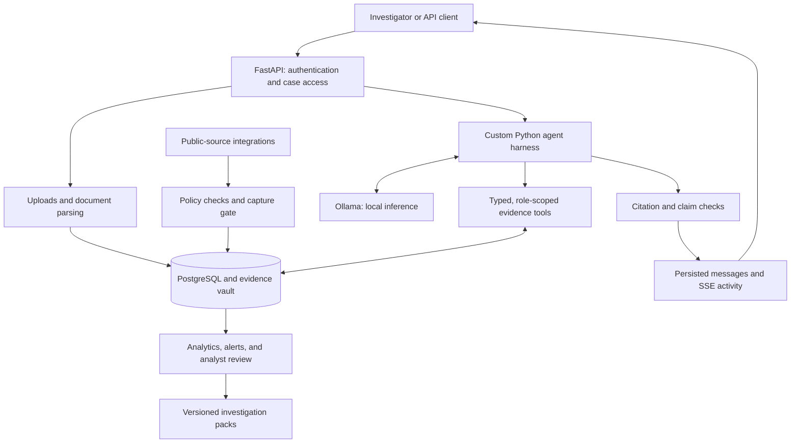

# DARKNETRA

**An evidence-first investigation workspace with local AI, a custom agent harness, and traceable research tools.**

DARKNETRA helps authorised investigators organise case material, search captured sources, review relationships, and prepare investigation reports. It combines Ollama for local model inference with a purpose-built Python harness that controls tool access, preserves case context, and checks citations against stored evidence.

[Quick start](#quick-start) · [How it works](#how-it-works) · [Integrations](#tools-and-integrations) · [Development](#development) · [Documentation](#documentation)

> **Branch scope:** `main` contains the backend service and research assets. The web interface follows a separate development track; its API integration contract is documented in [frontend.md](frontend.md).

## Capabilities

- **Case workspaces:** case membership, isolated investigation threads, evidence attachments, and persisted activity histories.
- **Evidence management:** document and chat-export ingestion, SHA-256 content addressing, source provenance, and append-only custody records.
- **Search and extraction:** lexical retrieval, optional local vector search, validated indicators, and excerpts with evidence codes and line references.
- **Assisted analysis:** local model conversations, deterministic correlation, relationship graphs, and candidate findings for analyst review.
- **Monitoring and reporting:** watchlists, deduplicated alerts, recorded analyst decisions, and versioned investigation packs.
- **Operational controls:** role-based access, scoped service tokens, audit events, health endpoints, and verified backup and restore scripts.

## How it works



1. **Open a case.** Assign members and define the permitted sources. The service binds evidence, conversations, and analysis to that case.
2. **Capture material.** Upload documents or collect an allowed public source. The backend stores original bytes and provenance before exposing excerpts to a model.
3. **Extract and retrieve.** Deterministic parsers produce text and validated indicators. Search returns case-scoped excerpts linked to their originals.
4. **Ask questions.** The custom harness supplies the model with case context and registered tools, then validates tool calls and records their results.
5. **Review the answer.** The claim checker checks evidence references and confirmation status. Analysts review proposed links and findings before confirming them.
6. **Track and export.** Watchlists produce evidence-linked alerts. Reports assemble persisted records, decisions, and citations into versioned artifacts.

### The custom harness

The orchestration code lives in [backend/darknetra/agent](backend/darknetra/agent). DARKNETRA owns the conversation lifecycle, tool loop, cancellation, execution limits, event persistence, and citation checks. Ollama supplies model inference through its local API.

The Ollama adapter exposes role-appropriate evidence tools and supports up to eight model turns per run. A lead can delegate bounded work to registered specialists, with a maximum of three sequential delegations and one delegation level. Specialists inherit case restrictions and share execution limits.

All registered tool calls pass through a common invocation path for schema validation, authorisation, policy checks, timeouts, and audit logging. The runtime stores messages, tool activity, and Server-Sent Events (SSE) in PostgreSQL so clients can reconnect and inspect execution history.

The default demonstration mode uses deterministic evidence quotations. Enable Ollama for model-generated answers using the configuration below. Ollama chats currently expose the evidence lane; public-source collection requires a network-enabled service, an eligible caller, and the relevant case permissions.

## Tools and integrations

The [tool registry](backend/darknetra/tools/registry.py) defines input and output contracts, allowed roles, source policies, and availability. External readers use the capture gate before returning evidence-linked results.

| Integration | Role in DARKNETRA | Availability and scope |
| --- | --- | --- |
| **Ollama** | Local inference through the custom harness | Requires a running Ollama service and installed model; the configured default is `qwen3:8b`. |
| **PostgreSQL 16, pgvector, and pg_trgm** | Case records, lexical search, and optional dense retrieval | PostgreSQL is required. Dense search needs a provisioned local embedding model. |
| **Robin and Ahmia** | Parse captured public search-index results | Uses attributed Robin parsing code. Results describe index entries; the adapter does not visit listed onion targets. |
| **DuckDuckGo and SearXNG** | Public web search through `surface_search` | DuckDuckGo HTML adapter included; SearXNG needs an operator-configured public HTTPS endpoint. Provider availability varies. |
| **Trafilatura** | Extract main text from captured public HTML | Included in `public_page_read`; uses DARKNETRA's capture transport. |
| **Agent Reach and Jina Reader** | Read public pages through `agent_reach_read` | Includes the public-web channel. Jina receives the requested URL; the captured output represents Jina's response. |
| **feedparser** | Parse captured RSS and Atom feeds | Included in `rss_read`; linked articles need separate captures. |
| **Wayback Machine** | Look up archive availability for a public URL | Included in `wayback_lookup`; requires network access. |
| **keys.openpgp.org** | Retrieve public keys by fingerprint | Included in `keyserver_lookup`; subject to case policy. |
| **mempool.space** | Capture public Bitcoin address summaries | Included in `chain_lookup`; other chains need additional adapters. |
| **MCP Python SDK** | Expose registered tools to compatible clients over stdio | Requires an existing case and a scoped, revocable service token. |

For dependency pins and upstream licences, see [third_party/README.md](third_party/README.md).

### Optional components and current limits

- **Local embeddings:** install the `embed` extra and provision a compatible 1,024-dimensional model directory. Lexical search remains available without it.
- **GNN research:** `classic_ml/` contains notebooks, predictors, and model artifacts. The backend adapter requires compatible assets in its expected runtime location and case ledger data; research files alone do not enable live assessments.
- **Additional readers:** live Tor collection, Telegram collection, person lookup, and sanctions screening remain unavailable in this branch's backend. Imported chat exports can still serve as evidence.
- **Extraction models:** OCR, transcription, and trained NER require additional assets and integration. An unavailable check remains unknown in the output.

## Quick start

### 1. Start the local backend

Install Git, `uv`, and Docker Desktop with its Linux engine enabled. The backend targets Python 3.12.

```powershell
git clone --branch main https://github.com/jrdevadattan/darknetra.git
cd darknetra
uv python install 3.12
uv run --project backend python scripts/manage.py dev
```

The development command creates a private `.env` if needed, starts PostgreSQL and the API, applies migrations, provisions the initial accounts, and imports the **SYNTHETIC** case `SYN-CHD-001`. Repeated starts preserve existing credentials and evidence.

| Endpoint | Purpose |
| --- | --- |
| [API documentation](http://127.0.0.1:8000/api/v1/docs) | Interactive API reference |
| [Readiness](http://127.0.0.1:8000/api/v1/health/ready) | Database, vault, and optional-service status |

Read the generated passwords from your local `.env`: `DARKNETRA_ADMIN_PASSWORD` for `administrator` and `DARKNETRA_DEMO_ANALYST_PASSWORD` for `analyst.demo`. Setup scripts generate these values and do not print them.

### 2. Enable Ollama

Start the bundled Ollama service and install the configured model:

```powershell
docker compose --env-file .env -f infra/docker-compose.yml --profile offline up -d ollama
docker compose --env-file .env -f infra/docker-compose.yml exec ollama ollama pull qwen3:8b
```

Edit the following values in your local `.env`:

```dotenv
DARKNETRA_HARNESS_MODE=offline
DARKNETRA_OFFLINE_MODE=true
DARKNETRA_OFFLINE_MODEL=qwen3:8b
DARKNETRA_OLLAMA_URL=http://127.0.0.1:11434
```

Apply the configuration to the API container:

```powershell
docker compose --env-file .env -f infra/docker-compose.yml up -d --no-deps --force-recreate api
```

Compose sets the API container's Ollama address to `http://ollama:11434`; the loopback address applies to a host-run API. The model download requires internet access and sufficient disk space and memory. After installation, Ollama can analyse captured evidence without external model calls.

To return to the quotation-based demo, set `DARKNETRA_HARNESS_MODE=deterministic` and recreate the API container.

### 3. Exercise the workflow

For the reproducible walkthrough, switch back to deterministic mode and recreate the API container as described above:

```powershell
uv run --project backend python scripts/manage.py demo
```

The walkthrough covers evidence, cited answers, correlation, analyst decisions, graphs, monitoring, and reports over HTTP. It uses labelled **SYNTHETIC** data.

## Configuration

[.env.example](.env.example) lists the service settings. Keep credentials, case data, model caches, and backups outside Git.

| Setting | Purpose |
| --- | --- |
| `DARKNETRA_HARNESS_MODE` | Use `offline` for Ollama or `deterministic` for evidence quotations. |
| `DARKNETRA_OFFLINE_MODE` | Blocks network-dependent research tools when `true`. |
| `DARKNETRA_OFFLINE_MODEL` | Name of the model installed in Ollama. |
| `DARKNETRA_OLLAMA_URL` | Ollama endpoint reachable from the API process. |
| `DARKNETRA_EMBEDDING_BACKEND` | Defaults to `none`; use `sentence_transformers` with a provisioned local model. |
| `DARKNETRA_EMBEDDING_MODEL_PATH` | Local directory for the compatible embedding model. |
| `DARKNETRA_SURFACE_SEARCH_SEARXNG_URL` | Optional public HTTPS SearXNG endpoint with JSON search enabled. |
| `DARKNETRA_WEB_ORIGIN` | Allowed browser origin; defaults to `http://localhost:3000`. |

## Development

Run these commands from the repository root. `make` aliases are also available in the [Makefile](Makefile).

| Command | Purpose |
| --- | --- |
| `uv run --project backend python scripts/manage.py test` | Migrate the dedicated test database, then run Ruff, strict mypy checks, and pytest. |
| `uv run --project backend python scripts/manage.py openapi` | Regenerate the tracked API contract. |
| `uv run --project backend python scripts/manage.py check-openapi` | Check the exported contract against the application. |
| `uv run --project backend python backend/scripts/run_retrieval_eval.py` | Run the synthetic retrieval evaluation. |
| `uv run --project backend python scripts/manage.py serve` | Start a host-run API after configuring and migrating the database. |
| `uv run --project backend python scripts/manage.py stop` | Stop the local stack while preserving volumes. |

The full test command requires PostgreSQL. The current runtime uses one API process per database because jobs and scheduling run in-process. Restart recovery marks interrupted work for review or retry and preserves original evidence.

### Repository layout

```text
backend/darknetra/
  agent/           Custom harness, conversations, delegation, and claim checks
  tools/           Typed registry, invocation path, and integration adapters
  capture/         Source validation and immutable capture
  policy/          Case restrictions and execution controls
  ingest/          Document and chat-export parsing
  rag/             Chunking, lexical search, and optional vector retrieval
  analytics/       Correlation, graphs, trends, and wallet assessment
  monitor/         Watchlists, scheduling, and alert generation
  reports/         Versioned investigation packs
backend/tests/     Unit, integration, contract, and scenario tests
classic_ml/        GNN research and model artifacts
data/synthetic/    Labelled demonstration fixtures
docs/              API contract, implementation records, and subsystem plans
infra/             Docker Compose and database setup
scripts/           Development, demonstration, backup, and restore commands
third_party/       Reused components and attribution
```

## Access and evidence integrity

Application routes use the `/api/v1` prefix. Browser authentication uses HttpOnly session cookies with CSRF protection; service clients use scoped bearer tokens. Case access checks apply to evidence, threads, findings, alerts, and reports.

The backend preserves original evidence, custody events, audit entries, and decisions. Analysts confirm findings through recorded decisions. Models propose claims and candidate relationships; citation checks establish references and coverage, while analysts assess the underlying evidence.

External collection uses policy-controlled GET/HEAD requests. The local Compose stack binds published services to loopback. Production deployment requires a separate operational review, including access, storage, retention, and recovery arrangements.

## Backup and restore

```powershell
uv run --project backend python scripts/backup.py
uv run --project backend python scripts/restore.py "backups/<backup-name>" --database darknetra_restore_rehearsal --vault backups/restored-vault
```

Backups contain a PostgreSQL dump, the evidence vault, and a SHA-256 manifest. Restore verifies the backup and referenced artifacts, and requires a fresh database and vault directory. Preserve encryption and signing keys in a separate secret store; backups exclude `.env`.

## Documentation

- [API contract](docs/openapi.json)
- [Frontend integration contract](frontend.md)
- [Implementation overview](docs/implementation-plan.md)
- [Subsystem plans](docs/plan/README.md)
- [Build progress and verification records](docs/build-progress.md)
- [Backend audit and remaining work](docs/backend-audit.md)
- [Third-party components and licences](third_party/README.md)
