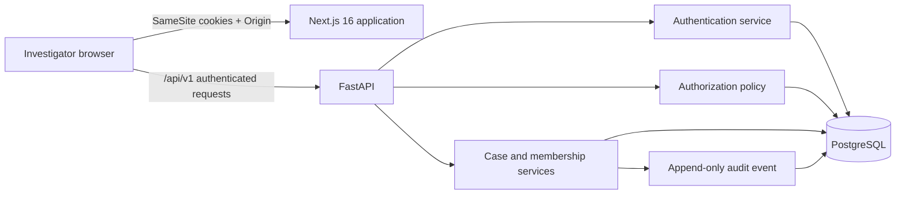

# Authentication, authorization, and auditable case access

This document describes the Plan 02 security boundary implemented by DARKNETRA. PostgreSQL is authoritative for users, authentication sessions, cases, case memberships, membership roles, and audit events. The Next.js application does not enforce security policy by itself; it presents the decisions made by the FastAPI policy layer.

## Security goals

Plan 02 establishes these guarantees:

1. Browser credentials produce a server-tracked session rather than a bearer token stored in browser storage.
2. State-changing requests require both an authenticated session and a valid CSRF token.
3. A global role alone does not grant ordinary access to every case. Effective case permissions are the intersection of global roles and roles assigned through that case's membership.
4. An inaccessible case identifier and an unknown case identifier are intentionally indistinguishable to the requester.
5. Business mutations and their audit events are committed in one database transaction.
6. Bootstrap credentials cannot be used for ordinary privileged mutations until the password is replaced.

## Runtime components



The browser calls FastAPI through the typed frontend API client with `credentials: include`. Access and refresh credentials never enter `localStorage` or `sessionStorage`.

## Identity and password storage

A user record contains a normalized unique username, display name, active state, global roles, forced-password-change state, failed-login counter, temporary lock timestamp, and UTC audit timestamps.

Passwords are hashed with Argon2 through `argon2-cffi`. The current policy:

- rejects NUL characters;
- requires 12 through 128 characters;
- rejects a password equal to the normalized username;
- never truncates a submitted password.

Authentication failures use a generic public response. The API does not disclose whether the username, password, account state, session, or lock state caused the failure.

## One-time administrator bootstrap

The initial administrator is created through the API CLI:

```bash
PYTHONPATH=apps/api \
DARKNETRA_DATABASE_URL='postgresql+psycopg://...' \
DARKNETRA_BOOTSTRAP_ADMIN_PASSWORD='replace-this-through-a-secret-channel' \
uv run python -m darknetra_api.cli bootstrap-admin \
  --username administrator \
  --display-name 'DARKNETRA Administrator'
```

The bootstrap service obtains a PostgreSQL transaction advisory lock and refuses to create an administrator when an administrator or the selected normalized username already exists. The resulting user receives the `ADMIN` global role and `must_change_password=true`; an `ADMIN_BOOTSTRAPPED` audit event is inserted before the transaction commits.

The password may be entered interactively instead of through `DARKNETRA_BOOTSTRAP_ADMIN_PASSWORD`. It must never be committed to the repository or printed to logs.

## Session and cookie design

A successful login creates an `auth_sessions` row and returns three cookies.

| Cookie | Contents | Browser access | Path | Default lifetime |
|---|---|---:|---|---:|
| `darknetra_access` | HS256 access JWT | HttpOnly | `/` | 15 minutes |
| `darknetra_refresh` | random refresh token | HttpOnly | `/api/v1/auth` | 8 hours |
| `darknetra_csrf` | random CSRF token | readable by the frontend | `/` | 8 hours |

All three cookies use `SameSite=Strict`. They use `Secure` outside the explicitly local development configuration. Access and refresh cookies are `HttpOnly`; the CSRF cookie is deliberately readable so the frontend can copy it into the `X-CSRF-Token` header.

The access JWT contains UUID user, session, and token identifiers; `typ=access`; issuer and audience claims; issued-at and not-before timestamps; and a 15-minute expiry. JWT signing uses HS256 with a base64 value that decodes to exactly 32 bytes. `DARKNETRA_JWT_SIGNING_KEY_B64` is required before an authenticated endpoint can issue or validate access tokens.

The database stores only SHA-256 hashes of refresh and CSRF tokens. It does not store the plaintext values returned to the browser.

## Login throttling and temporary lock

The authentication service applies both a coarse process-level login rate limit and a per-user deterministic lock policy.

- Each invalid password increments `failed_login_count` and appends `LOGIN_FAILED`.
- Five consecutive invalid passwords cap the counter at five, set `locked_until` to five minutes in the future, and append `ACCOUNT_TEMP_LOCKED`.
- A successful login resets the counter and lock timestamp.
- Locked, inactive, unknown, and invalid-credential accounts all receive the same public authentication error.

The process-level guard currently permits 120 login attempts per rolling minute before returning the generic rate-limited authentication response. This is defense in depth, not a substitute for the persistent per-user lock.

## Refresh rotation and reuse detection

Refresh is a one-time rotation operation:

1. The API hashes the submitted refresh token and locks the matching session row.
2. The submitted CSRF value must match the stored CSRF hash.
3. The old session is marked revoked with reason `rotated`.
4. A replacement database session, refresh token, CSRF token, and access token are created.
5. `SESSION_REFRESHED` is appended and the transaction commits.

If a refresh token from a session already revoked as `rotated` is submitted again, DARKNETRA treats it as reuse. Every still-active session for that user is revoked with reason `refresh_reuse_detected`, `REFRESH_TOKEN_REUSE_DETECTED` is appended, and authentication fails generically.

Expired, inactive-user, logged-out, and otherwise revoked sessions cannot be used to create an authentication context.

## CSRF and origin validation

Cookie authentication makes the browser attach credentials automatically, so state-changing endpoints require an independent anti-CSRF proof.

- Login requires an `Origin` header equal to `DARKNETRA_WEB_ORIGIN`.
- Refresh, change-password, logout, case mutations, and membership mutations validate browser origin when present.
- Every state-changing authenticated operation requires `X-CSRF-Token` to match the current session's CSRF hash.
- The frontend API client adds the header from the `darknetra_csrf` cookie for non-safe HTTP methods.
- CORS allows credentials only from the configured web origin and exposes only the required methods and headers.

A missing or incorrect CSRF token returns `403` without performing the mutation.

## Forced password change

The bootstrap administrator can authenticate, but the policy layer blocks normal mutation permissions while `must_change_password=true`. The frontend `SessionGate` directs such a session to `/auth/v2/change-password` instead of rendering the ordinary investigator shell.

The forced-change form retains logout access. A successful password change:

- validates the new password policy;
- replaces the Argon2 hash;
- clears `must_change_password`;
- appends `PASSWORD_CHANGED`;
- commits once;
- returns the investigator to the dashboard.

For later voluntary password changes, the current password is also required.

## Role and permission source of truth

`apps/api/darknetra_api/authz/policy.py` is the enforcement source and the source returned by `GET /api/v1/admin/roles`. The frontend does not maintain an independent permission matrix.

Supported global roles are:

- `ADMIN`
- `CASE_OWNER`
- `COLLECTOR`
- `ANALYST`
- `REVIEWER`
- `AUDITOR`
- `VIEWER`

Current permissions are:

- `CASE_CREATE`
- `CASE_READ`
- `CASE_UPDATE`
- `CASE_CLOSE`
- `CASE_REOPEN`
- `CASE_MEMBERSHIP_MANAGE`
- `USER_READ`
- `USER_MANAGE`
- `ROLE_READ`
- `AUDIT_READ`
- `SYSTEM_HEALTH_READ`

`ADMIN` holds every permission. `CASE_OWNER` holds the case lifecycle and membership permissions plus user, role, and audit reads. The remaining roles hold the narrower read permissions defined in the policy map. Any policy change must be made in the backend map and verified through the administration API; it must not be patched only in the UI.

## Global and case-scoped authorization

Global authorization checks that the user is active and that at least one global role grants the required permission.

Case authorization adds a membership intersection:

```text
effective case roles
  = roles stored on this case membership
    ∩ roles currently held globally by the user
```

The requested permission must be granted by at least one effective role. This prevents a stale or over-broad membership from granting a role the investigator no longer holds globally.

A case membership may contain one or more roles from the global vocabulary except `ADMIN`. The database enforces the `ADMIN` exclusion. Case owners retain a `CASE_OWNER` membership, and membership services prevent removal of the last case owner.

A global administrator may bypass membership only for the explicitly administrative `CASE_MEMBERSHIP_MANAGE` repair path. The repair remains audited. `ADMIN` does not silently become a member of every case for ordinary reads.

## Anti-enumeration policy

Case absence and case invisibility share the `CaseNotFound` domain outcome. For case-scoped resources:

- an unknown UUID returns HTTP `404` with `{"detail":"resource not found"}`;
- a valid but inaccessible UUID returns the same status and response body;
- the frontend renders the same `Case unavailable` state and does not substitute fixture content.

Task 13 verifies this contract in a real browser against a disposable PostgreSQL database by comparing the inaccessible and unknown responses and rendered experience.

A genuine permission failure after a visible membership has been established may return `403`; the `404` rule specifically prevents existence disclosure through case identifiers.

## Case lifecycle and memberships

The stable case API is versioned under `/api/v1`:

- `POST /cases`
- `GET /cases`
- `GET /cases/{case_id}`
- `PATCH /cases/{case_id}`
- `POST /cases/{case_id}/close`
- `POST /cases/{case_id}/reopen`
- `GET /cases/{case_id}/members`
- `POST /cases/{case_id}/members`
- `PATCH /cases/{case_id}/members/{user_id}`
- `DELETE /cases/{case_id}/members/{user_id}`

Visible case lists are filtered in SQL and paginated. Offset pagination uses a default limit of 25, a maximum of 100, and stable descending update/id ordering.

Case creation automatically creates the owner's case membership and `CASE_OWNER` role. Membership roles are normalized relational rows rather than comma-separated strings.

## Transactional audit rule

Every mutation follows this boundary:

```text
validate → authorize → mutate business state → append audit event → commit once
```

The audit event is added to the same SQLAlchemy session as the business mutation. If the audit insert or another statement fails, the transaction is rolled back and the business mutation does not commit independently.

Audit events contain actor, event type, resource type and identifier, optional case identifier, request identifier, constrained metadata, and UTC creation time. ORM event listeners reject updates and deletes, making audit records append-only through the application model.

Examples include:

- `ADMIN_BOOTSTRAPPED`
- `LOGIN_SUCCEEDED`
- `LOGIN_FAILED`
- `ACCOUNT_TEMP_LOCKED`
- `SESSION_REFRESHED`
- `REFRESH_TOKEN_REUSE_DETECTED`
- `PASSWORD_CHANGED`
- `LOGOUT`
- `CASE_CREATED`
- `CASE_UPDATED`
- `CASE_CLOSED`
- `CASE_REOPENED`
- membership add, update, and removal events

Authentication secrets, password hashes, plaintext tokens, and session internals are not audit metadata.

## Frontend session boundary

The Next.js application uses a typed API client and TanStack Query.

- `SessionGate` exposes checking, unauthenticated, forced-change, authenticated, and backend-unavailable states.
- A `401` current-user response triggers one refresh attempt before redirecting to login.
- Network failure renders an explicit authentication-service-unavailable state rather than redirecting or showing protected fixture content.
- Login stores the returned user in the query cache but never stores access or refresh tokens.
- Successful logout clears the entire TanStack Query cache before redirecting, preventing sensitive case data from surviving into a later session in the same tab.
- Case transport responses are mapped into the retained UI `CaseSummary` interface so view components do not depend on API field casing.

## Read-only administration APIs

Plan 02 exposes:

- `GET /api/v1/users` with safe identity fields only;
- `GET /api/v1/admin/roles` from the enforcement policy map;
- `GET /api/v1/audit` with permission checks, filters, and pagination.

User responses omit password hashes, refresh/CSRF hashes, failed-login counters, lock internals, and other authentication secrets. Unauthorized administration screens render explicit access-denied states rather than empty tables.

## Configuration

Required or security-relevant API variables:

| Variable | Meaning |
|---|---|
| `DARKNETRA_ENVIRONMENT` | Runtime environment; local cookie relaxation is limited to explicit development/local origins |
| `DARKNETRA_DATABASE_URL` | PostgreSQL SQLAlchemy URL |
| `DARKNETRA_WEB_ORIGIN` | Exact browser origin allowed for credentialed CORS/origin checks |
| `DARKNETRA_JWT_SIGNING_KEY_B64` | Secret base64 value decoding to exactly 32 random bytes |
| `DARKNETRA_BUILD_VERSION` | Version label exposed by health endpoints |

The web application uses `DARKNETRA_API_BASE_URL` for server-to-API traffic and `NEXT_PUBLIC_DARKNETRA_API_BASE_URL` for browser traffic. Only the API location belongs in the public variable; secrets must never use a `NEXT_PUBLIC_` prefix.

## Verification boundaries

Plan 02 verification includes:

- unit and PostgreSQL integration tests for password, token, CSRF, lock, lifecycle, membership, audit, and cross-case behavior;
- frontend component tests for login, forced change, logout cache clearing, session states, live cases, and administration reads;
- synthetic browser regressions for explicit online/offline UI states;
- a real Compose-backed browser suite with deterministic test-only users and cases;
- migration, lint, type, build, Compose, and Docker smoke gates.

The real fixture CLI refuses to run unless `DARKNETRA_ENVIRONMENT=test`, the database name visibly contains `test`, and every synthetic password is supplied through the environment. Its output contains identifiers and usernames, never credentials.

## Deliberate architecture deviation

Plan 02 uses UUID4 identifiers until an approved UUIDv7 implementation is selected. See [ADR-0002](../decisions/0002-use-uuid4-until-approved-uuidv7.md). No custom UUID algorithm was introduced.
