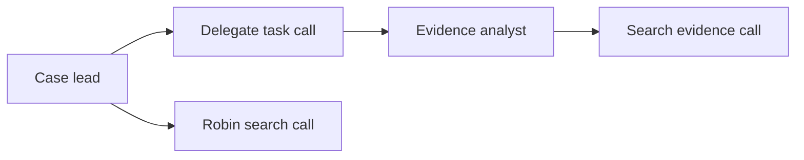

# DARKNETRA frontend: case workspace and agent activity

Backend integration contract and repository research, 8 September 2026. The Chakra UI
frontend is implemented in `frontend/` and consumes `docs/openapi.json`; this document extends
`docs/plan/15-frontend-track.md` with the requested agent activity workspace.

## Product layout

The sidebar contains cases, case chats, private normal chats, monitoring and plugins.
Normal chats use `/chats`; investigative chats require a case. Private chats have
no case tools, evidence access or delegation. Sharing uses authenticated case membership, not a
public evidence URL. The case work area has a conversation and activity timeline,
with an execution graph beside it. Selecting a graph node opens its activity history,
status, tool metadata, duration and evidence references.

Keep two distinct graphs: the **execution graph** shows who delegated or invoked
what; the existing **case relationship graph** shows evidence, candidates and human
decisions. Chat prose and graph animations cannot create either kind of fact.

## How the agent chooses work

The lead model sees its registered tool schemas and can call a tool directly or
choose `delegate_task` with a specialist role and task. The backend authorizes every
call. It is not an unconstrained decision to connect arbitrary MCP servers. The
current Claude adapter presents the registry through the `darknetra` SDK MCP server;
the standalone MCP adapter exposes the same tools to an authenticated case-bound
client. Ollama uses function calls through the same invocation gate.

Delegation is one level, with at most three specialists per root run and one active
specialist at a time. The root run reserves a separate worker budget, shares a total
tool/deadline cap, and cancellation propagates to awaited workers. Worker output is
citation-checked before returning to the lead. Child activities persist under the
root run; they are not independently resumable jobs or separate normal chats.
Show actual child nodes only after receiving their backend records. Live provider
behavior remains unverified without model credentials/weights; deterministic and
test harness operation must be labelled accordingly.

## Frontend data flow

1. Create/read a case thread using the existing case APIs. Posting to
   `/api/v1/cases/{case_id}/threads/{thread_id}/messages` returns a run ID.
2. GET `/api/v1/cases/{case_id}/threads/{thread_id}/runs/{run_id}/execution`.
   The snapshot supplies `schema_version`, `run_status`, `cursor`, `nodes`, `edges`,
   chronological activity `events`, `truncated`, `cost_usd`, `cost_complete`, and
   `replayed_from_run_id` (`cost_complete=null` means no completeness record).
3. Subscribe to the existing `/events` SSE endpoint with `Last-Event-ID: {cursor}`.
   Use a fetch-based SSE client when a custom header or service token is required;
   browser EventSource cannot set arbitrary headers. Normal browser auth uses the
   application's cookies; mutations also require its CSRF header and allowed origin.
4. Apply each `activity.updated` by stable node `id`. Ignore duplicate or older
   sequence numbers. Store event sequence per run, never across cases. A gap between
   activity sequences can be normal: other SSE event types share the same sequence.
5. Existing `run.started`, `run.step`, `message.delta`, `message.completed`,
   `store.changed`, `run.error`, `run.cancelled`, and `run.finished` remain supported.
   Avoid duplicate cards: `run.step.call_id` corresponds to the activity/tool-call ID.
   Use verified `message.completed` for final claims; a delta is provisional text.
6. On `store.changed`, refetch relevant case REST resources. Do not populate evidence
   or findings from model prose. On terminal run state, settle active indicators;
   refresh the snapshot to identify activities marked `interrupted` after a restart
   or missing completion. `terminal_inferred=true` is not a successful tool result.
7. To cancel, POST to the run's `/cancel` endpoint. The browser cannot assume the
   request alone means every operation has stopped; reconcile terminal events.

The snapshot locks the run row while reading its cursor and activity records. New
events therefore replay after the returned cursor without a snapshot/subscription
race. It returns at most 10,000 activity events. If `truncated=true`, show incomplete
history explicitly; do not claim a complete graph. Older runs without these new
events have only a root in `/execution`; separately GET `/runs/{run_id}` for their
existing `tool_calls`. Do not invent phase histories for those calls.
Replayed answers retain their source run ID and do not animate tools as newly run.

## Activity contract and UI states

Each update has `id`, `parent_id`, `kind` (`agent`, `tool`, `stage`), `label`, `status`,
`phase`, `summary`, `seq`, and `at`. Optional fields include `agent_role`, `tool_name`,
`integration_id`, `adapter_kind`, `transport`, `duration_ms`, `cached`, `error_code`,
`evidence_ids` and `evidence_codes`. OpenAPI defines the precise types and defaults.

States: `queued`, `running`, `completed`, `denied`, `failed`, `cancelled`,
`interrupted`. Tool phases include `authorizing`, `executing`, `fetching`, `persisting`,
`captured`, `parsing`, `cache_hit`, `complete`, `error`, `cancelled`. These are measured backend
operations; providers do not necessarily expose their internal stages. Durations
are observed, not fabricated percentages. Repeated calls to the same tool have
different IDs; fetching/persisting/completion for one call reuse its ID.

This is a conceptual example, not an actual executed run. Evidence chips on tool
nodes open authorized evidence/context APIs. Do not add an evidence node without
a real returned reference.

**Thinking display:** show concise public operational summaries such as “Preparing
response”, “Checking tool authorization”, “Specialist reviewing case evidence”, or
“Persisting captured evidence”. Do not request, persist, or display raw private
chain-of-thought, hidden reasoning blocks, signatures or SDK debug envelopes. Generic
status text is not an evidentiary claim. A disconnected browser says “Reconnecting”,
not “Agent stopped”; keep connection state separate from execution state.

**Provider labels:** GET `/api/v1/tools` includes display names, integration identity,
adapter kind, schemas, roles, supported invocation transports and health. This is a
catalogue, not a case-specific authorization grant. `robin_search` currently uses an
attributed local Robin parser and captured public Ahmia index. Its card can say
“Robin search · via DARKNETRA MCP” when the event transport is `sdk_mcp`/`stdio_mcp`.
Never say “Connecting to Robin MCP”: no separate Robin MCP server is configured.
Similarly, installed, configured, unprobed, running, unavailable and rate-limited
are distinct states. Show source denials explicitly; zero hits is not an outage.

The final `run.finished.cost_complete` indicates whether all provider usage was
reported. A cancellation can prevent a provider's final usage report; display
incomplete cost instead of asserting a known zero. Model budgets are provider caps
plus recorded usage, not a guaranteed final invoice.

## Repositories to reuse

Candidate versions were checked against primary sources; none are installed here.

| Repository | Candidate / license | Integration decision |
|---|---|---|
| [xyflow / React Flow](https://github.com/xyflow/xyflow) | [12.11.6](https://github.com/xyflow/xyflow/releases/tag/%40xyflow/react%4012.11.6), MIT | Recommended execution graph: custom nodes, edges, pan/zoom. Render backend records; React Flow does not orchestrate agents. |
| [assistant-ui](https://github.com/assistant-ui/assistant-ui) | [0.15.18](https://github.com/assistant-ui/assistant-ui/releases/tag/%40assistant-ui/react%400.15.18), MIT | Recommended chat primitives with [ExternalStoreRuntime](https://www.assistant-ui.com/docs/runtimes/custom/external-store). Adapt our messages and cancellation callbacks. |
| [Vercel AI Elements](https://github.com/vercel/ai-elements) | Reviewed commit `6a9d5b1822ffb10bba4bd97175f01edd7d8651cd`, Apache-2.0 | Optional Tool/Agent/status card source reuse. Preserve license. Components do not make our stream compatible with AI SDK `useChat`. |
| [CopilotKit](https://github.com/CopilotKit/CopilotKit) | [1.70.1](https://github.com/CopilotKit/CopilotKit/releases/tag/v1.70.1), MIT | Alternative if standard AG-UI interoperability is desired; requires a protocol adapter. Do not adopt a second runtime simply for cards. |
| [AG-UI](https://github.com/ag-ui-protocol/ag-ui) | [2026-08-31 release](https://github.com/ag-ui-protocol/ag-ui/releases/tag/release/2026-08-31), MIT | Event protocol reference, not an orchestrator or graph component. Optional future adapter. |
| [LangGraph Agent Chat UI](https://github.com/langchain-ai/agent-chat-ui) | MIT | Sidepanel reference. Expects a LangGraph server and messages state; not compatible with our API without adaptation. |
| [LangGraph Supervisor](https://github.com/langchain-ai/langgraph-supervisor-py) | MIT | Supervisor-pattern reference. Upstream recommends direct tool-based supervisors for most use cases; retain the current audited registry approach. |

Use React Flow directly with a read-only node/edge view and an accessible timeline.
Disable node deletion, connection editing and persistence mutations. AI Elements'
Canvas wrapper defaults to Delete/Backspace support, which is unsuitable for durable
execution records. Retain Cytoscape for the separate evidence relationship graph.
[React Flow custom nodes](https://reactflow.dev/learn/customization/custom-nodes),
[AI Elements Canvas](https://elements.ai-sdk.dev/components/canvas).

AG-UI is not a one-to-one event rename: `ToolCallEnd` means arguments finished,
not execution finished; `ToolCallResult` carries the result. `StateDelta` uses RFC
6902 patches, whereas our `store.changed` means refetch. An adapter needs message
boundaries and explicit custom invalidation events. Do not claim protocol support
until it has conformance tests. [Official event semantics](https://docs.ag-ui.com/concepts/events).

## Frontend acceptance checklist

- Typed contract-shaped client; one run-scoped activity stream drives the activity panel and timeline.
- Reload/reconnect, repeated calls, denials, provider errors, cancellation, cache hits,
  replay and restart interruption behave consistently in both views.
- Only actual delegated children appear; show current sequential execution honestly.
- Keyboard-accessible list mode and stable node positioning; reduced-motion support.
- Case switching clears subscriptions/state; inaccessible cases return the same 404.
- Evidence drawers use authorized APIs; no credentials, full tool arguments, raw
  provider envelopes or private reasoning enter browser activity payloads.
- Chakra UI 3.37, theme toggle, login, case/private-chat separation, case creation,
  thread creation, provider/budget choices, and API-backed case panels are implemented.
  Arbitrary third-party plugin installation, independently resumable/parallel workers
  and advanced Tor monitoring remain future work. UI checks cover the public login route,
  Next production build, client contract tests, and live `/api/v1/health/live` proxy.

## Backend completion additions

All routes below are relative to `/api/v1` and use the existing authentication/CSRF rules.

| Surface | Contract |
|---|---|
| Normal chats | `POST/GET /chats`, `GET/PATCH /chats/{chat_id}`. Private owner access only, including for administrators; other users receive 404. |
| Normal chat execution | `POST/GET /chats/{chat_id}/messages`; `GET /chats/{chat_id}/runs/{run_id}`; `/events` with `Last-Event-ID`; `POST /cancel`. One active run per chat. |
| Private answer status | Verification is `NOT_APPLICABLE`: the message is not an evidence-backed case finding. Persisted SSE exposes lifecycle/completed answers, not incremental token streaming or a fabricated subagent graph. |
| Plugins | `GET /plugins`, `GET /cases/{case_id}/plugins`; `PATCH /admin/plugins/{plugin_id}` accepts `{enabled, manifest_hash}`. These are reviewed bundled integrations; UI must not claim arbitrary repository installation. |
| Case plugin policy | Existing case PATCH `source_policy.enabled_plugins`: `null` permits the reviewed catalog, `[]` disables external plugins, a list permits only those IDs. Administrator global disable still wins. |
| Provider choice | Case harness now includes `NIM`; private providers support AUTO, CLAUDE, NIM and OFFLINE. Missing provider/weights produce explicit unavailable results. |
| Retrieval | `mode_used` reflects semantic/hybrid only when the loaded model and entire eligible index match. Otherwise render the returned lexical fallback and `dense_available=false`. |
| Case summary card | `GET /cases/{case_id}/digest?since=...` returns counts, bounded open alerts and recent findings. `since` must be timezone aware. |
| Thread memory | Existing `summary` now contains bounded historical user requests, refreshed every six assistant messages. Do not display it as confirmed evidence. |
| Suspended monitoring | Show `state.suspension_reason`, failed runs and operational alerts when execution authority is revoked; per-source backoff lives in persisted item state. |

HTTP provider outputs are bounded complete answers. A running state must not animate
invented token activity. Costs are conservative reserves rounded upward to four decimal
places; incomplete provider usage must retain its incomplete flag. See
`docs/backend-audit.md` for activation requirements and remaining roadmap work.

## Backend continuation: monitoring attempt visibility

The existing `GET /cases/{case_id}/monitor/runs` response now includes `RUNNING`
attempts while collection is in progress. Poll it for the monitoring panel; it is
separate from chat-run SSE. Interrupted attempts finish as `ERROR` with an
`errors.execution` entry and a public reason (`CANCELLED`, `RUN_FAILED`, or
`APPLICATION_RESTART`). Watchlist item state carries the last outcome and persisted
retry time. A retry creates a new attempt; earlier attempt history remains visible.
This provides operational status, not private model reasoning. Collection remains
single-process; externally queued or independently resumable workers are not implied.

For evidence text, `line_offsets` and tool/context line numbers use LF boundaries.
`page_map` contains zero-based, end-exclusive line intervals: PDF page order, XLSX
sheet order, or PPTX slide order. Blank source units can have empty intervals. DOCX
uses `null` because rendered page boundaries cannot be inferred from its paragraph XML.
The map describes extracted text, not visual coordinates; cached spreadsheet values
are not evidence that a formula was recalculated.
